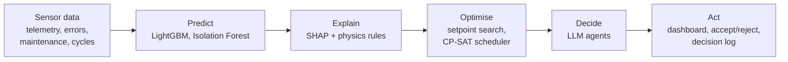
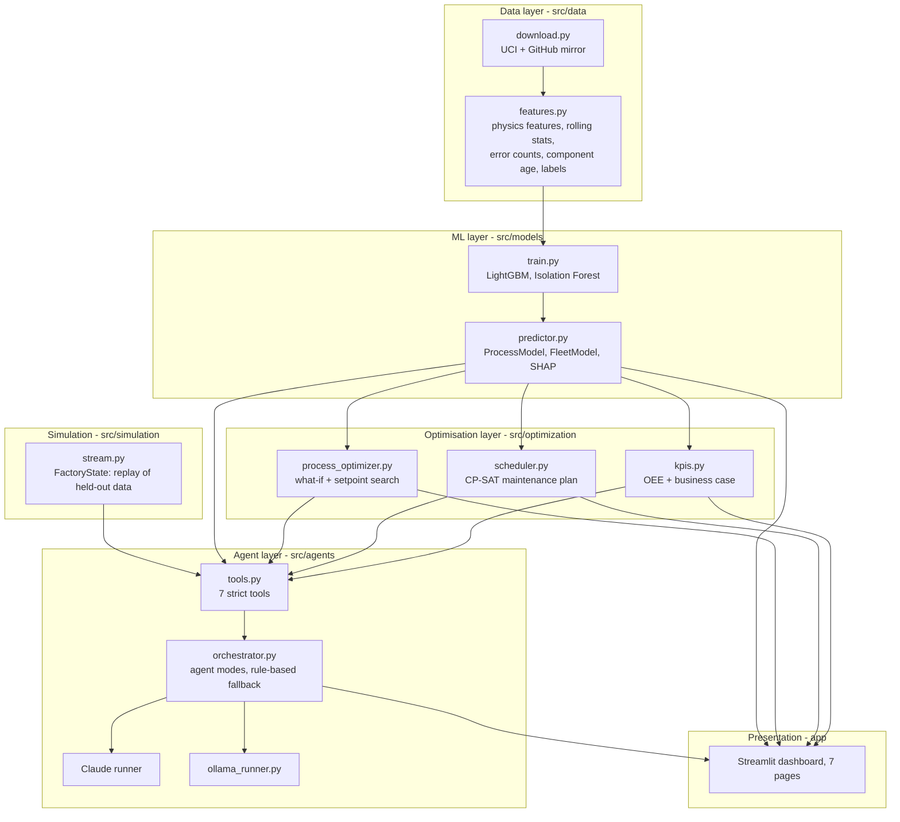
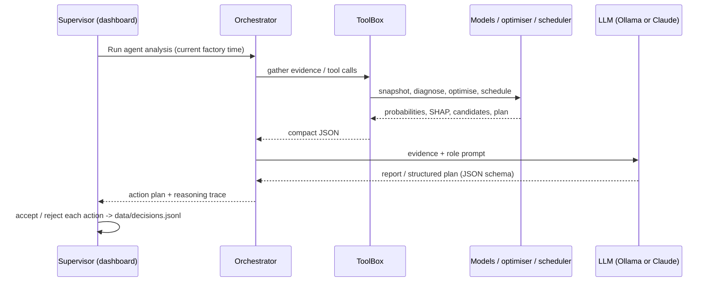

# Smart Manufacturing Process Optimization

**Domain:** Manufacturing & Industrial IoT

AI-driven predictive maintenance and workflow optimisation for a factory. Machine
learning models analyse sensor data and predict failures; optimisers turn those
predictions into setpoint changes and a maintenance schedule; LLM-based decision
agents turn everything into a prioritised, explained action plan for the shift
supervisor. All of it runs in a Streamlit dashboard.

---

## Contents

1. [Problem](#1-problem)
2. [Solution overview](#2-solution-overview)
3. [Datasets](#3-datasets)
4. [Architecture](#4-architecture)
5. [Data pipeline and features](#5-data-pipeline-and-features)
6. [Predictive models](#6-predictive-models)
7. [Optimisation](#7-optimisation)
8. [Decision agents (LLM layer)](#8-decision-agents-llm-layer)
9. [Dashboard](#9-dashboard)
10. [Setup and running](#10-setup-and-running)
11. [Configuration reference](#11-configuration-reference)
12. [Testing](#12-testing)
13. [Project layout](#13-project-layout)
14. [Design decisions](#14-design-decisions)
15. [Limitations and next steps](#15-limitations-and-next-steps)

---

## 1. Problem

Factories lose output to three linked problems:

| Problem | Symptom | What this project does |
|---|---|---|
| **Machine downtime** | Components fail without warning; an unplanned repair stops a machine far longer than a planned one (24 h vs 4 h in this project's assumptions) | Predicts component failures 24 hours and 7 days ahead; flags abnormal sensor behaviour |
| **Quality losses** | Production cycles fail through heat build-up, power overload, overstrain or tool wear | Predicts cycle failure and its mode, explains the physical cause, and finds safer setpoints |
| **Unoptimised workflows** | Maintenance is reactive or calendar-based, ignoring risk, crew capacity and production load | Schedules maintenance to minimise expected cost under crew and load constraints |

## 2. Solution overview



- **Predict** component failures (24h and 7-day horizons), production-cycle failures, and failure modes.
- **Explain** each prediction with SHAP feature contributions and the known physical failure rules.
- **Optimise** process setpoints with a model-verified what-if search, and the weekly maintenance plan with OR-Tools CP-SAT.
- **Decide** with LLM agents that call the models as tools and produce a structured, prioritised action plan. The agents run on a free local model (Ollama) or on Claude.
- **Operate** from a dashboard where every recommendation can be accepted or rejected, and every decision is logged.

**Core principle: the LLM never predicts failures.** The trained models,
optimiser and scheduler are the source of truth. The LLM interprets their output,
connects the evidence and communicates the decision. Setpoint recommendations are
re-scored by the failure model before they are shown.

## 3. Datasets

Several public datasets were evaluated:

| Dataset | Verdict |
|---|---|
| **AI4I 2020 Predictive Maintenance** (UCI #601) | ✅ **Used.** Labelled failure modes with known physical causes, so predictions map to concrete process fixes. |
| **Microsoft Azure Predictive Maintenance** | ✅ **Used.** Time series for a 100-machine fleet with errors, maintenance history and failures; needed for downtime, scheduling and OEE. |
| NASA C-MAPSS Turbofan | Remaining-life benchmark, but turbofan engines, not factory machines |
| SECOM (UCI) | Quality only; 590 anonymised sensors give the agents nothing to reason about |
| Bosch Production Line (Kaggle) | ~14 GB and anonymised; too heavy and not explainable |

| | AI4I 2020 | Azure PdM |
|---|---|---|
| Scope | Machining line, one row per production cycle | 100 machines, hourly, calendar year 2015 |
| Size | 10,000 cycles, 3.39% failures | 876,100 telemetry rows, 3,919 errors, 3,286 replacements, 761 failures |
| Signals | Air/process temperature, speed, torque, tool wear, product quality variant (L/M/H) | Voltage, rotation, pressure, vibration; error codes; machine model and age |
| Labels | Machine failure + modes: tool wear (TWF), heat dissipation (HDF), power (PWF), overstrain (OSF), random (RNF) | Failure time per component (comp1-comp4) |
| Used for | Process risk, failure-mode diagnosis, setpoint optimisation, quality KPI | Fleet health, component failure forecasts, anomaly detection, maintenance planning, availability KPI |
| Source | [UCI #601](https://archive.ics.uci.edu/dataset/601) | Microsoft's mirror in [microsoft/sqlworkshops](https://github.com/microsoft/sqlworkshops) (the original Azure blob is offline) |

Both datasets are synthetic, built from real physics (AI4I) or real plant patterns
(Azure). Expect lower model scores on real plant data.

## 4. Architecture

### 4.1 Layers



### 4.2 Request flow for an agent run



### 4.3 Factory simulation

The dashboard replays **held-out data only** as a live factory:

- **Fleet clock:** the Azure test period (1 Sep 2015 onwards) in 3-hour steps.
- **Machining line:** the AI4I 20% test cycles, including every failing one.

Models and agents only see the state at the current clock position. Actual future
failures are shown only in a "ground truth" expander for demo evaluation and are
never passed to the agents.

## 5. Data pipeline and features

```
python -m src.data.download   ->  data/raw/*.csv
python -m src.data.features   ->  data/processed/ai4i_features.parquet, azure_features.parquet
python -m src.models.train    ->  models/*.joblib, reports/metrics.json, data/processed/ai4i_test.parquet
```

### AI4I features (per production cycle)

| Feature | Definition | Why |
|---|---|---|
| `temp_diff_k` | process temp - air temp | Heat dissipation fails when < 8.6 K at low speed |
| `power_w` | torque x rpm x 2π/60 | Power failure outside 3,500-9,000 W |
| `strain_minnm` | tool wear x torque | Overstrain beyond 11,000 / 12,000 / 13,000 min·Nm (L/M/H) |
| `strain_ratio` | strain / limit for the product variant | Makes the overstrain limit comparable across variants |
| `type_code`, setpoints | L/M/H as 0/1/2, raw readings | Base signals |

The same failure rules are implemented as explicit **physics-rule flags**
(`physics_rule_flags`). They give the agents hard, explainable evidence and
cover tool-wear failure (flag from 190 min), which no model can predict.

### Azure features (per machine, sampled every 3 hours)

| Group | Features |
|---|---|
| Telemetry | volt, rotate, pressure, vibration + 3h and 24h rolling mean and std (computed on full hourly data) |
| Errors | count of each error code (error1-error5) in the last 24h |
| Component age | days since each component was last replaced (strictly before t, to avoid leakage) |
| Machine | model, age |
| Labels | component fails within 24h / within 7 days (strictly after t) |

Result: 292,100 rows x 41 columns.

## 6. Predictive models

| Model | Algorithm | Output |
|---|---|---|
| Machine failure (process) | LightGBM | P(cycle fails), alert threshold tuned on out-of-fold predictions |
| Failure mode x4 (TWF, HDF, PWF, OSF) | LightGBM | P(each mode) |
| Component failure within 24h x4 | LightGBM | P(comp fails in 24h), drives urgent alerts |
| Component failure within 7 days x4 | LightGBM | P(comp fails in 7 days), drives weekly scheduling |
| Anomaly detector | Isolation Forest on 24h telemetry stats | Score: 0 = typical, > 1 = beyond the 99th percentile of normal |
| Explanations | SHAP TreeExplainer | Per-prediction feature contributions (log-odds) |

### Evaluation (held-out; `reports/metrics.json`)

**Machining line (AI4I), stratified 80/20 split**

| Target | PR-AUC | ROC-AUC | Precision | Recall | Brier |
|---|---|---|---|---|---|
| Machine failure (threshold 0.47) | 0.891 | 0.978 | 0.949 | 0.824 | 0.0075 |
| Heat dissipation (HDF) | 1.000 | 1.000 | 1.000 | 1.000 | 0.0000 |
| Power (PWF) | 0.982 | 1.000 | 0.917 | 0.846 | 0.0011 |
| Overstrain (OSF) | 0.971 | 1.000 | 0.889 | 1.000 | 0.0010 |
| Tool wear (TWF) | 0.061 | 0.886 | 0 | 0 | 0.0050 |

**Fleet (Azure PdM), time split: train Jan-Aug 2015, test Sep 2015 onwards**

| Target | PR-AUC | ROC-AUC | Precision | Recall (p = 0.5) |
|---|---|---|---|---|
| comp1-comp4 fail within 24h | 0.996-1.000 | 1.000 | 0.974-1.000 | 0.993-1.000 |
| comp1-comp4 fail within 7 days | 0.345-0.517 | 0.906-0.980 | 0.450-0.639 | 0.212-0.376 |
| Anomaly detector | flags 11.4% of readings in the 24h before a failure vs 1.0% overall | | | |

Reading the results:

- The 24h fleet models are near-perfect because the Azure dataset is synthetic with strong pre-failure signals.
- The 7-day models are about 10x better than the 2.4-4.9% base rate. That's enough to rank components for weekly planning.
- Tool-wear failure is random between 200 and 240 minutes of wear, so no model can predict it from one cycle. The physics rule covers it.

## 7. Optimisation

### 7.1 Process setpoint optimiser (`process_optimizer.py`)

- **Search space:** speed -15% to +25%, torque -30% to +50% (5% steps), optional tool change. Candidates are kept within the range seen in training.
- **Constraint:** speed ≥ `min_throughput_ratio` x current speed (default 0.9; speed is the throughput proxy).
- **Objective:** failure probability + 0.5 x throughput loss + a small penalty on the size of the change + a tool-change penalty (prefers the smallest fix that works).
- **Verification:** every candidate is scored by the trained failure model; `simulate()` re-scores any what-if scenario.
- **Result:** brings **67 of 68** failing test cycles below 20% risk.

Example (a heat-dissipation failure): speed 1363 → 1431 rpm (+5%) takes the risk from 99.9% to 0.01%, because it moves speed above the 1380 rpm heat-dissipation limit.

### 7.2 Maintenance scheduler (`scheduler.py`, OR-Tools CP-SAT)

- **Jobs:** every (machine, component) with 24h or 7-day risk ≥ 5%.
- **Decision:** replace on day *d* of the horizon, or don't schedule.
- **Cost of replacing on day d:** planned cost + planned downtime x that day's production load + P(fails before d) x unplanned cost.
- **Cost of not scheduling:** P(fails within horizon) x unplanned cost.
- **Failure timing:** P(fails before day d) = 1 − (1 − p24h) x (1 − h)^(d−1), where h is the constant daily hazard implied by the 7-day probability.
- **Constraint:** at most `crew_per_day` jobs per day.
- **Example (26 Sep 2015):** 14 jobs scheduled; expected cost $187,603 vs $326,776 run-to-failure, an **expected saving of $139,174** for that week.

### 7.3 KPIs (`kpis.py`)

OEE = availability x performance x quality:

| Component | Source | Value |
|---|---|---|
| Availability | Azure: 761 failures x 24 h + 2,143 planned replacements x 4 h downtime over 100 machine-years | 96.9% |
| Performance | mean rotation vs nominal (450 rpm) | 99.3% |
| Quality | share of AI4I cycles without failure | 96.6% |
| **OEE** | | **92.9%** |

Predictive-maintenance projection: the 24h models detect 99.7% of failures;
assuming 70% of detections become planned work (`PDM_REALIZATION`), that's
**531 failures prevented, 10,623 downtime hours saved and ~$14.1M saved per
year**, raising OEE to **94.1%**. All costs and downtime hours are assumptions
in `src/config.py`; edit them for your plant.

## 8. Decision agents (LLM layer)

### 8.1 Agents and tools

| Agent | Tools | Output |
|---|---|---|
| Monitoring | `get_fleet_overview`, `get_machine_details` | Prioritised watch-list |
| Diagnosis | `get_process_status`, `get_fleet_overview`, `get_machine_details` | Failure mode → mechanism → evidence |
| Maintenance planning | `plan_maintenance`, `get_fleet_overview`, `get_plant_kpis` | Day-by-day plan, cost vs run-to-failure, capacity trade-offs |
| Process optimisation | `get_process_status`, `optimize_process_setpoints`, `simulate_process_change` | Verified setpoint change |
| Coordinator | none; JSON-schema output | De-duplicated, prioritised action plan |
| Chat assistant | all 7 tools | Answers questions, runs what-ifs |

The seven tools (`src/agents/tools.py`) have strict JSON schemas and return
compact JSON. Unknown arguments are dropped, and a tool error is returned to the
model rather than crashing the run.

The action plan schema has: `headline`, `situation_summary`, `actions[]`
(`priority`, `category`, `urgency`, `target`, `action`, `rationale`,
`expected_impact`, `source_agents`), and `risks_and_caveats[]`.

### 8.2 LLM backends (`LLM_PROVIDER`)

| | `ollama` (default) | `claude` |
|---|---|---|
| Model | `qwen3:4b` (configurable) | `claude-opus-5-5` (configurable) |
| Cost | Free, no token limits, offline | Pay per token; needs API credits |
| Setup | Install [Ollama](https://ollama.com), `ollama pull qwen3:4b` | `ANTHROPIC_API_KEY` in `.env` |
| Default agent mode | `narrate` | `tools` (specialists run in parallel) |
| API features used | Tool calling, JSON-schema `format`, `keep_alive`, context and output caps | Adaptive thinking, effort, strict tools, structured outputs, server-side refusal fallback |

Cursor was considered but offers no public API for calling its models from an
application; its API only runs Cursor's own coding agents.

### 8.3 Agent modes (`AGENT_MODE`)

| Mode | What the LLM does | LLM calls |
|---|---|---|
| `tools` | Each specialist chooses and calls its own tools (multi-round); a coordinator merges the reports | 10-30 |
| `evidence` | The code runs each specialist's tools; the LLM writes 4 reports, then the merged plan | 5 |
| `compact` | The code runs all tools; the LLM writes the whole action plan in one call | 1 |
| `narrate` | The models, optimiser and scheduler build the actions; the LLM writes the headline, summary and caveats | 1 |

Measured on this project's dev laptop (Intel i5-1135G7, no GPU, 20 GB RAM, `qwen3:4b`):

| Mode | Time | Plan quality |
|---|---|---|
| `narrate` | **86 s** (9 GB free RAM); 101 s under memory pressure | Good: actions are model-grounded; briefing mostly accurate |
| `compact` | 612 s | Weaker: rated a 100%-in-24h failure as "this week"; generic headline |
| `evidence` | ~8 min per report (hit the output cap) | Not practical on CPU |
| `tools` | A single call exceeded 10 min | Not practical on CPU |

Why: on this CPU the model reads prompts at ~30-36 tokens/s and generates at
~2-8 tokens/s, and generation slows as the context grows (1.8 tokens/s at a 4k
context). `narrate` keeps the prompt near 1k tokens and the output near 200.
On a GPU, or with Claude, use `compact` or `tools` for LLM-driven planning.

`llama3.2` (3B) was also tested and rejected: it claimed to have run a what-if
simulation it never called. That's why the lighter modes run the tools in code.

### 8.4 Reliability safeguards

- **Grounding:** every prompt requires numbers to come from tool results; in `evidence`, `compact` and `narrate` modes the code runs the tools, including the what-if verification.
- **Structured output:** plans are generated against a JSON schema; Ollama output is validated with `jsonschema` and retried once.
- **Graceful fallback:** if the backend is unavailable or a call fails (no credits, Ollama down, timeout), the deterministic rule-based planner produces the plan and the dashboard shows why.
- **Append-only history:** chat turns are appended; a failed turn is rolled back so the history stays valid.
- **Claude-specific:** server-side refusal fallback (`fallbacks: "default"`), refusal / `max_tokens` / `pause_turn` handling, typed error mapping.
- **Human in the loop:** every action is accepted or rejected by the supervisor and logged to `data/decisions.jsonl`.

## 9. Dashboard

`streamlit run app/streamlit_app.py`, then open the URL it prints (default http://localhost:8501; use `--server.port 8502` if 8501 is busy).

| Page | Content |
|---|---|
| Fleet overview | KPI tiles (critical/elevated/anomalous machines, OEE with and without PdM), 7-day risk heatmap, business case, watch-list |
| Machine health | Per-component 24h/7-day risk, SHAP drivers, 14-day telemetry (hourly and 24h mean), errors, replacements, ground truth |
| Process optimizer | Cycle diagnosis, failure-mode probabilities, physics flags, SHAP drivers, optimiser candidates ("Apply best candidate"), what-if simulator |
| Maintenance plan | Horizon and crew sliders, crew load per day vs capacity, schedule, expected cost vs run-to-failure |
| Agent action plan | Run the agents; prioritised actions with accept/reject; specialist reports and reasoning trace |
| Assistant | Chat with tool access; suggested questions; tool-call trace |
| Model performance | All evaluation metrics |

The sidebar has the factory clock (slider, +3h, +1 day), the production-cycle
picker, and the active decision engine.

## 10. Setup and running

Requirements: Python 3.11+ (developed on 3.13), ~1 GB disk for data and models,
and for local agents [Ollama](https://ollama.com) with ~4 GB free RAM.

```bash
pip install -r requirements.txt

cp .env.example .env                # choose the LLM backend
ollama pull qwen3:4b                # local model for the agents (~2.5 GB)

python -m src.data.download         # ~80 MB
python -m src.data.features         # ~10 s
python -m src.models.train          # ~1 min

streamlit run app/streamlit_app.py
```

To use Claude instead: set `LLM_PROVIDER=claude` and `ANTHROPIC_API_KEY` in `.env`
(the account needs API credits).

Tips for local models on a CPU:

- Close memory-heavy apps: with 0.4 GB free RAM the same run took 101 s instead of 86 s, and longer runs slowed far more.
- Ollama keeps generating a request after the app gives up on it. If a run times out, check `ollama ps` and wait before retrying, or the next run queues behind it.
- The chat assistant uses live tool calling; expect several minutes per question on a CPU.

## 11. Configuration reference

### `.env` (see `.env.example`)

| Variable | Default | Meaning |
|---|---|---|
| `LLM_PROVIDER` | `ollama` | `ollama` or `claude` |
| `AGENT_MODE` | `narrate` (Ollama) / `tools` (Claude) | `narrate`, `compact`, `evidence`, `tools` |
| `AGENT_MAX_TOOL_ROUNDS` | 5 (Ollama) / 8 (Claude) | Tool-call rounds per agent before it must answer |
| `OLLAMA_MODEL` | `qwen3:4b` | Any tool-capable Ollama model |
| `OLLAMA_HOST` | `http://localhost:11434` | Ollama server |
| `OLLAMA_NUM_CTX` | 8192 | Context window (smaller is faster on CPU) |
| `OLLAMA_MAX_OUTPUT` | 1024 | Max generated tokens per call |
| `OLLAMA_THINK` | `false` | Reasoning mode: better, much slower |
| `OLLAMA_TIMEOUT_S` | 600 | Per-call timeout |
| `ANTHROPIC_API_KEY` | - | Claude API key |
| `CLAUDE_MODEL` | `claude-opus-5-5` | Claude model |
| `CLAUDE_EFFORT` | `medium` | `low` to `max` |
| `CLAUDE_MAX_TOKENS` | 16000 | Max output tokens |

### Business assumptions (`src/config.py`)

| Setting | Default |
|---|---|
| `COST` | unplanned failure $12,000; planned replacement $1,500; downtime $800/h |
| `DOWNTIME_HOURS` | unplanned 24 h; planned 4 h |
| `MAINTENANCE_CREW_PER_DAY` | 4 jobs |
| `PLANNING_HORIZON_DAYS` | 7 |
| `DAILY_LOAD` | 1.0, 1.2, 1.2, 1.0, 0.8, 0.5, 0.4 (relative production load per day) |
| `NOMINAL_ROTATION` | 450 rpm |
| `PDM_REALIZATION` | 0.7 (share of detected failures converted to planned work) |
| `AZURE_SPLIT_DATE` | 2015-09-01 |

## 12. Testing

```bash
python -m pytest
```

32 tests, no network, API or LLM calls (the LLM clients are mocked):

| File | Covers |
|---|---|
| `test_features.py` | Derived features and each physics rule |
| `test_optimization.py` | Failure-timing model, scheduler capacity and urgency, low-risk skipping, optimiser fixing a heat-dissipation failure (independently re-simulated) |
| `test_agents.py` | Strict tool schemas, every tool runs, rule-based plan matches the schema, Claude loop (tool execution, errors, refusal), Ollama loop and JSON retry, evidence and narrate modes, fallback on API errors, chat rollback |
| `test_app.py` | Every dashboard page renders headlessly (Streamlit AppTest) |

## 13. Project layout

```
SMPO/
├─ .env.example                  LLM backend settings template (copy to .env)
├─ requirements.txt
├─ src/
│  ├─ config.py                  paths, model/LLM settings, business assumptions
│  ├─ data/
│  │  ├─ download.py             fetch AI4I (UCI) and Azure PdM (GitHub mirror)
│  │  └─ features.py             feature engineering, labels, physics rules
│  ├─ models/
│  │  ├─ train.py                train + evaluate, writes models/ and reports/metrics.json
│  │  └─ predictor.py            ProcessModel, FleetModel, SHAP explanations
│  ├─ optimization/
│  │  ├─ process_optimizer.py    what-if simulation, setpoint search
│  │  ├─ scheduler.py            CP-SAT maintenance scheduler
│  │  └─ kpis.py                 OEE and PdM business case
│  ├─ simulation/stream.py       FactoryState: replay of held-out data
│  └─ agents/
│     ├─ tools.py                7 tool definitions + ToolBox
│     ├─ prompts.py              agent prompts, action-plan and briefing schemas
│     ├─ orchestrator.py         agent modes, Claude runner, chat, rule-based fallback
│     ├─ ollama_runner.py        local-model runner
│     └─ base.py                 AgentResult, AgentError
├─ app/
│  ├─ streamlit_app.py           entry point and navigation
│  ├─ common.py                  shared state, caching, sidebar, chart helpers
│  └─ app_pages/                 overview, machine, process, maintenance, agents, assistant, performance
├─ notebooks/01_eda.ipynb        exploratory analysis
├─ tests/                        pytest suite
├─ data/                         raw/, processed/, decisions.jsonl   (generated, git-ignored)
├─ models/                       trained models                      (generated, git-ignored)
└─ reports/metrics.json          evaluation results
```

## 14. Design decisions

| Decision | Why |
|---|---|
| Two datasets | AI4I explains *why* a cycle fails (physics); Azure provides fleet time series, downtime and maintenance history |
| LLM as decision layer, not predictor | Model predictions are measurable and testable; the LLM connects evidence and communicates |
| LightGBM without class re-weighting | Keeps probabilities calibrated for cost calculations; imbalance handled by tuning the alert threshold |
| Time-based split for the fleet | Test months lie in the future relative to training, so there's no look-ahead |
| 7-day classifier instead of days-to-failure regression | The regressor was barely better than predicting the median (MAE 15 days when a failure was under 7 days away) |
| Physics rules alongside ML | Covers the unpredictable tool-wear mode and gives hard evidence for explanations |
| Optimiser verifies with the model | No recommendation is shown without a predicted risk reduction |
| CP-SAT scheduling | Exact optimisation of risk vs load vs crew capacity; solves in < 1 s |
| Pluggable LLM backend | Free local operation (Ollama) or stronger reasoning (Claude), same tools and plan schema |
| `narrate` default on CPU | The only mode fast enough (~1.5 min) on a laptop without a GPU; keeps actions grounded |
| Rule-based fallback | The dashboard works with no LLM at all |

## 15. Limitations and next steps

**Limitations**

- Both datasets are synthetic; 24h fleet scores will be lower on real data.
- The two datasets describe different plants; they're joined at the decision layer, not at the machine level.
- Cost, downtime and load figures are assumptions.
- The scheduler charges downtime separately for two components replaced on the same machine on the same day.
- Small local models can misstate facts in their prose; the actions and numbers come from the models.
- No authentication; decisions are logged to a local file.

**Next steps**

- Connect a real data source (OPC UA / MQTT historian) in place of the replay.
- Calibrate the 7-day probabilities (isotonic) and retrain on real failure history.
- Group same-machine jobs into a single stop in the scheduler.
- Feed accept/reject decisions back into scheduling and prompt tuning.
- Run the agents on a GPU or Claude and switch to `compact` or `tools` mode.
- Add sign-in (`st.login`) and a database for the decision log.
